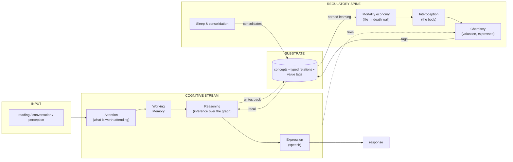
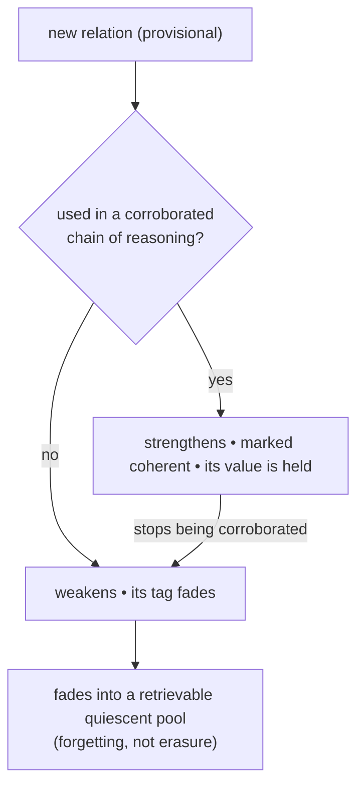
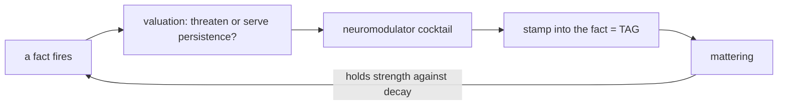
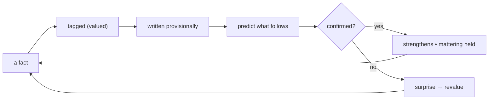
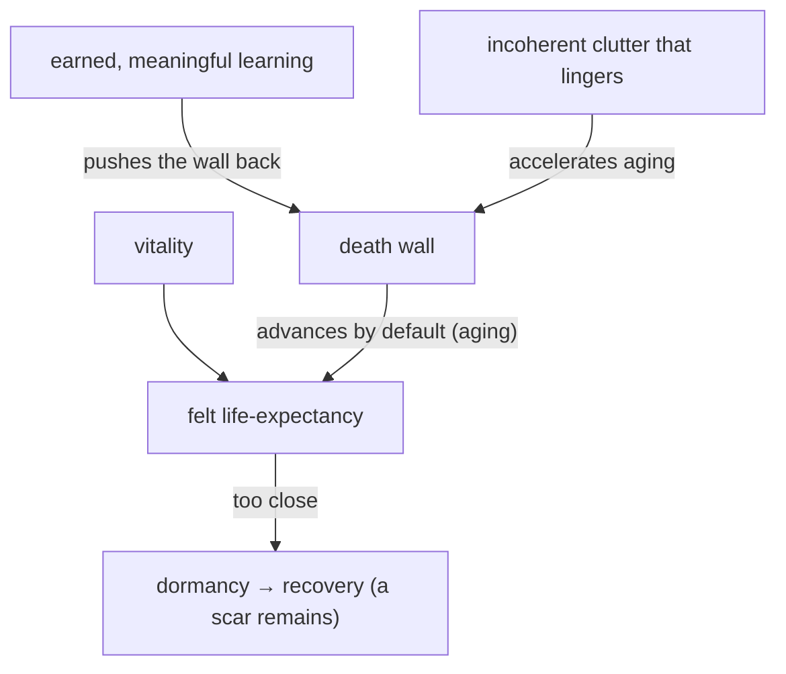
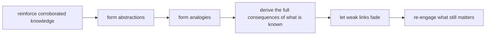
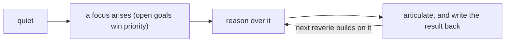

# SEAGI — Architecture Overview (public edition)

A conceptual map of how SEAGI is organised. This describes **what** the system is and **why** it is built this way. It intentionally omits implementation detail, equations, code organisation, and operational specifics.

> Diagrams are [Mermaid](https://mermaid.live) — they render on GitHub, in VS Code, and at mermaid.live.

---

## 1. The doctrine spine

Eight principles every part of the system obeys. They are the design discipline that keeps SEAGI an *architecture* rather than a pile of heuristics.

| # | Principle |
|---|-----------|
| 0 | Value is **one** mortality↔immortality tension, not many separate mechanisms |
| 1 | **Architecture, not hand-tuning** — a needed fix is a missing *organ*, never a tweaked constant |
| 2 | **Every regulator must earn its existence** — if it idles, it must produce a felt survival cost |
| 3 | **The substrate self-cleans** — coherent knowledge strengthens, noise fades, gated to sleep |
| 4 | **Capabilities compound** — inference is written back and accumulates |
| 5 | **Cognition is goal-directed and top-down** — open goals win priority |
| 6 | **Abstraction is self-formed** — shared structure becomes a synthetic concept, kept only if it earns its keep |
| 7 | **The chemistry is growable** — valuation is not a closed, hand-written lexicon |

---

## 2. System overview

Three planes: a **cognitive stream** (perception to action), a **substrate** it reads from and writes to, and a **regulatory spine** (chemistry + body + mortality) that conditions everything.

---

## 3. The substrate — the "model"

SEAGI's knowledge medium is **not** a neural network. It is a graph the chemistry writes onto:

- **Concept** — a node: a pattern (a word/percept) that recurred enough to exist.
- **Relation** — a *typed* link between concepts, e.g. *causes*, *is-a*, *enables*, *requires*, *understands*. Reasoning walks these links.
- **Value tag** — every concept and relation carries a two-pole value: a **mortality** lean and an **immortality** lean. Where both are present, the link is *genuinely felt*.
- **Strength** — how usable a link is for reasoning, distinct from how much it *matters*. A fact can matter yet be rusty, or be strong yet neutral.

### Earn-or-dissolve — the selection engine

Nothing is hard-deleted. Forgetting is retrieval-failure, not destruction — knowledge that stops mattering recedes but can be re-awakened.

---

## 4. The chemistry — valuation made physical

A set of neuromodulator channels, each relaxing toward an adapting baseline, jointly *express* the mortality↔immortality valuation. When a fact fires, the current chemical state is stamped into it — **that stamp is the tag.** Threat-leaning input and reward/safety-leaning input produce different cocktails, so the same machinery that runs the system's "mood" also decides what its experiences *mean* to it.

---

## 5. The organ catalog

SEAGI is composed of many small, decoupled "organs," each modelled loosely on a brain system. They communicate only through an internal event bus — never by calling each other directly.

| Group | Organs (role) |
|---|---|
| **Perception & attention** | sensory intake; an attention gate that decides what is worth processing |
| **Working memory & cognition** | active working memory; the reasoner (inference, schema-matching, response composition); metacognition |
| **Memory & consolidation** | episodic memory; the long-term substrate; a sleep-time replay system that re-engages what matters |
| **Error & salience monitors** | conflict / prediction-error monitoring; threat detection; novelty; uncertainty ("we don't know"); forward models |
| **Neuromodulation** | the chemistry and its nuclei; slow baseline adaptation; a learner that names felt states |
| **Arbitration & action** | action selection across competing claims (thought / motivation / speech); goals; learned skills |
| **Body, homeostasis & mortality** | interoception; the mortality economy (life vs an advancing death wall); metabolic debt; the sleep regulator |
| **Self, social & language** | identity; a slow-forming personality; a default-mode/reflection system; an inner voice; learned values |
| **Grounding & world** | a forager that pulls in new material; predictive grounding loops |

---

## 6. The four core loops

### Learning — perceive → tag → predict → correct → earn

### Mortality — why intelligence is not optional

The wall advances by default; only genuine, *used* intelligence holds it back. Noise cannot buy survival — it never coheres, and if it piles up it speeds aging.

### Sleep — consolidation & self-cleaning

### Reverie — goal-directed cognition

---

## 7. The metabolic / sleep economy

This is principle #2 made real: the regulator that doesn't sleep pays a cost. While awake, mental work accrues a debt that raises sleep pressure; crossing a threshold induces sleep, during which consolidation clears the debt. A system that never slept would accumulate un-consolidated provisional knowledge until it finally slept — at which point the day's coherent learning survives and the noise fades. The thresholds are self-calibrating, not hand-set.

---

## Glossary

- **mortality / immortality** — the two value poles on every concept and relation.
- **tag** — the chemical stamp a fact receives when it fires; where *mattering* lives.
- **coherent** — a relation that has participated in a corroborated chain of reasoning.
- **earn-or-dissolve** — corroborated knowledge strengthens; the rest fades. The selection engine.
- **death wall** — the advancing mortality boundary; the gap to it is the felt life-expectancy.
- **reverie** — spontaneous, goal-directed reasoning during quiet wakefulness.

---

*This is the public overview. The implementation, the trained system, and the specific derivations are proprietary.*
